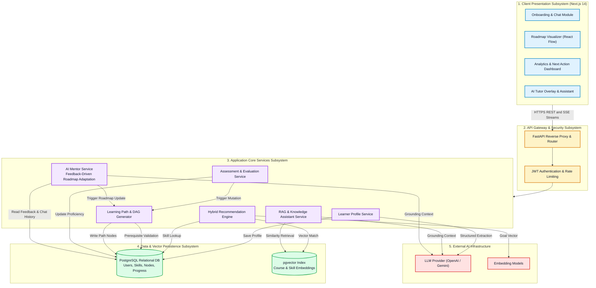
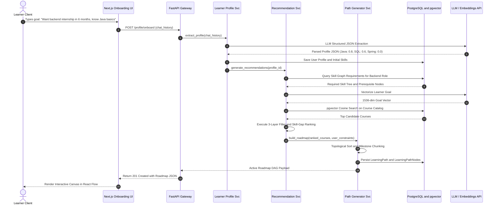
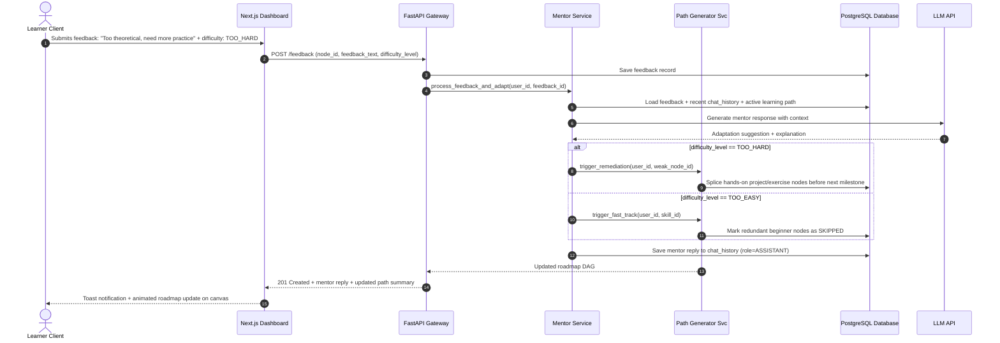
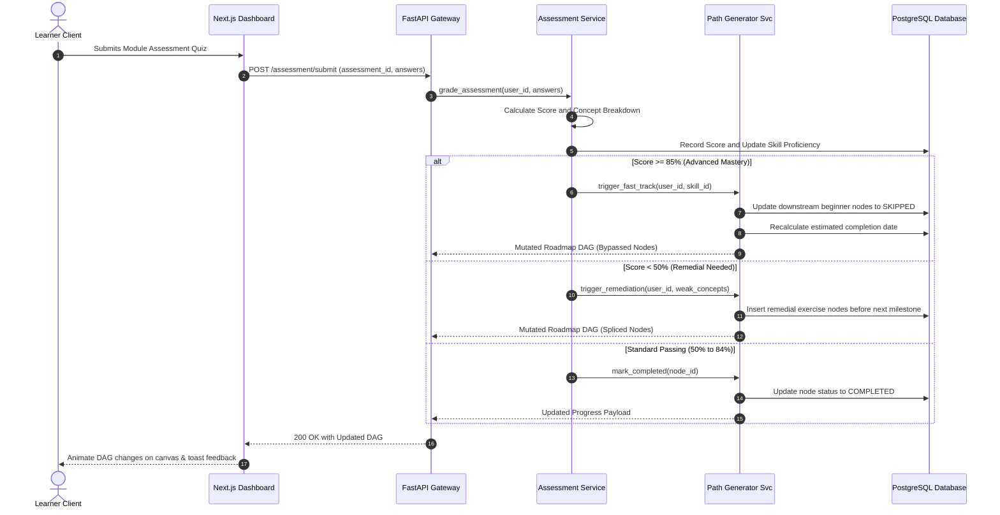
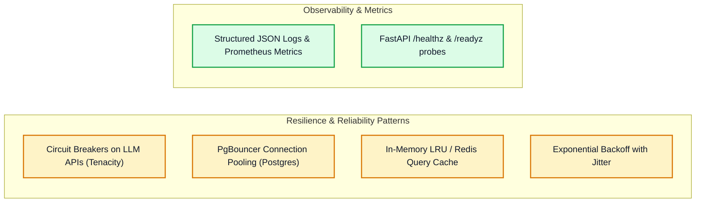
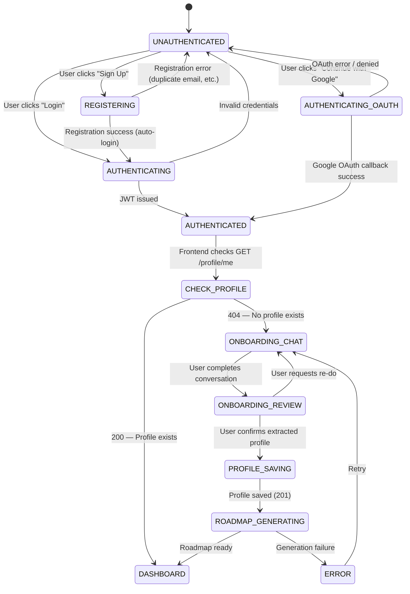
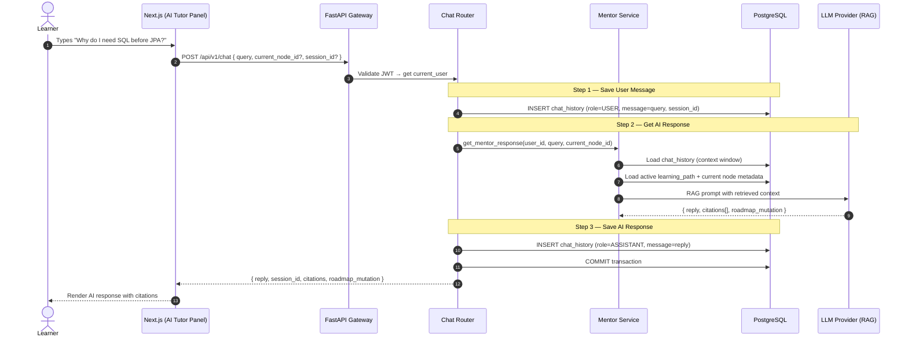

# High-Level Design (HLD) Document
## AI Learning Path Copilot

---

## 1. Executive Summary & Design Scope

The **High-Level Design (HLD)** defines the modular decomposition, subsystem boundaries, inter-service communication protocols, and end-to-end data flows for the AI Learning Path Copilot.

The platform's primary goal is to guide learners through a personalized, prerequisite-aware curriculum by marrying **deterministic graph processing** (Skill Trees, Prerequisite Rules) with **probabilistic generative AI** (LLM-based profiling, natural language tutoring, and semantic vector matching).

---

## 2. Subsystem Decomposition & Component Model

The system is decomposed into six logical subsystems operating across three physical tiers (Client, Application, and Persistence).

---

## 3. Subsystem Domain Responsibilities

### 3.1 Client Presentation Subsystem (Next.js)
- **Conversational Onboarding:** Multi-step natural language dialogue capturing learner background, target career roles, available study hours, and current skill confidence.
- **Interactive Roadmap (React Flow):** Visualizes the learning roadmap as a Directed Acyclic Graph (DAG) with custom nodes (Milestones, Courses, Projects, Assessments) and dynamic states (`LOCKED`, `IN_PROGRESS`, `COMPLETED`, `SKIPPED`).
- **Dashboard & Next Action:** Aggregates overall curriculum completion percentage, skill mastery radar charts, and renders a high-priority "Next Action Card".
- **AI Tutor Interface:** Persistent floating chat panel supporting real-time streaming markdown, code syntax highlighting, and cited reference chips.

### 3.2 Learner Profile Service
- **Entity Extraction:** Consumes raw onboarding transcripts and leverages LLM Structured Function Calling to output strict Pydantic schemas.
- **Skill Proficiency Tracker:** Maintains continuous proficiency ratings ($0.0 \dots 1.0$) for every known skill in the user's personal inventory.

### 3.3 Hybrid Recommendation Engine
- **Layer 1 (Prerequisite Rule Filter):** Eliminates courses where prerequisite skills have proficiency $< 0.7$, and courses whose topics the student has already mastered ($\ge 0.8$).
- **Layer 2 (Semantic Vector Search):** Employs `pgvector` Cosine Distance matching between the learner's goal vector and pre-indexed course embeddings.
- **Layer 3 (Skill-Gap Scoring):** Ranks candidate resources using:
  $$\text{PriorityScore} = W_{\text{goal}} \times (1.0 - \text{Proficiency}_{\text{current}}) \times (1.0 + \sum \text{PrerequisiteWeight})$$

### 3.4 Learning Path Generator
- **DAG Construction:** Topologically orders recommended modules to guarantee prerequisite integrity.
- **Milestone Chunking:** Organizes nodes into weekly/monthly sprints based on the learner's time commitment budget (e.g., 8 hours/week).

### 3.5 Assessment & Evaluation Service
- **Quiz Engine:** Generates targeted concept assessments and records submission scores.
- **Path Mutation Dispatcher:** Emits events when scores cross thresholds:
  - $\ge 85\%$: Fast-tracks the learner by tagging downstream introductory nodes as `SKIPPED`.
  - $< 50\%$: Dynamically queries the Recommender Service and splices remedial exercise nodes into the active graph.

### 3.6 RAG & AI Assistant Service
- **Vector Retrieval:** Performs similarity search across chunked course syllabi, documentation, and skill taxonomy.
- **Grounded Prompt Synthesis:** Injects retrieved context into system prompts with strict anti-hallucination instructions.

### 3.7 AI Mentor Service (`mentor_service.py`)
- **Feedback Processing:** Reads submitted `feedback` records (difficulty level + free text) after a user completes a node.
- **Proactive Adaptation:** If `difficulty_level == TOO_HARD`, calls `PathGeneratorService` to splice remedial nodes. If `TOO_EASY`, fast-tracks.
- **Context-Aware Chat:** Injects chat history + active node context into every LLM call so the mentor maintains conversational continuity across sessions.
- **Roadmap Recalibration:** When the user updates study hours (`PUT /profile/me`), recalculates milestone timelines without regenerating the full roadmap.

---

## 4. End-to-End Dynamic Data Flows

### 4.1 Onboarding & Initial Roadmap Generation Flow

---

### 4.3 User Feedback & Roadmap Update Flow

### 4.2 Assessment Evaluation & Adaptive Roadmap Mutation Flow

---

## 5. Non-Functional Architecture & Resilience

### 5.1 High-Availability & Scalability
- **Stateless Application Servers:** All FastAPI worker containers are stateless. Sessions are authenticated via cryptographically signed JWTs, allowing horizontal pod autoscaling behind load balancers.
- **Connection Management:** Connection pooling via PgBouncer prevents PostgreSQL socket exhaustion during peak concurrent API invocations.
- **LLM Rate-Limit Resilience:** External AI calls are wrapped with `tenacity` retry decorators using exponential backoff with random jitter to gracefully handle provider 429 rate limit spikes.

---

## 6. Detailed AI Workflows & State Machines

### 6.1 Onboarding State Machine

### 6.2 AI Tutor Chat Sequence

