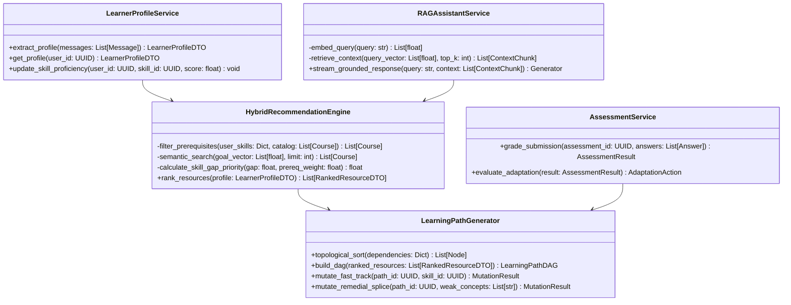
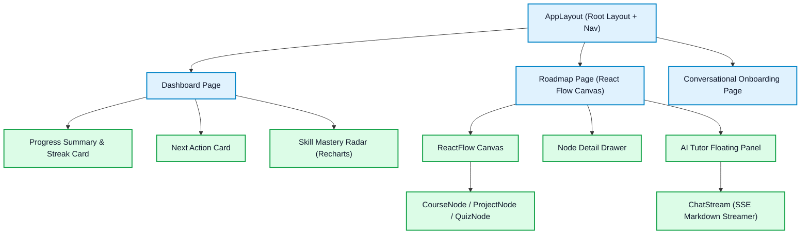

# Low-Level Design (LLD) Document
## AI Learning Path Copilot

---

## 1. Backend REST API Endpoint Specifications

All endpoints are hosted under the `/api/v1` namespace and require the `Authorization: Bearer <JWT>` header unless marked Public.

### 1.1 Authentication Endpoints (`/api/v1/auth`)

#### `POST /api/v1/auth/register` (Public)
- **Request Body:**
  ```json
  {
    "email": "learner@example.com",
    "password": "SecurePassword123!",
    "full_name": "Jane Doe"
  }
  ```
- **Response `(201 Created)`:**
  ```json
  {
    "id": "a0eebc99-9c0b-4ef8-bb6d-6bb9bd380a11",
    "email": "learner@example.com",
    "full_name": "Jane Doe",
    "created_at": "2026-08-28T02:00:00Z"
  }
  ```

#### `POST /api/v1/auth/login` (Public)
- **Request Body:** `application/x-www-form-urlencoded` (`username`, `password`)
- **Response `(200 OK)`:**
  ```json
  {
    "access_token": "eyJhbGciOiJIUzI1NiIsInR5cCI6IkpXVCJ9...",
    "token_type": "bearer",
    "expires_in": 1800
  }
  ```
- **Set-Cookie:** `refresh_token=...; HttpOnly; Secure; SameSite=Strict; Path=/api/v1/auth/refresh; Max-Age=604800`

---

### 1.2 Learner Profiling & Onboarding (`/api/v1/profile`)

#### `POST /api/v1/profile/onboard`
- **Description:** Consumes conversation history from the conversational onboarding flow, invokes LLM function calling to parse entities, and creates the user profile.
- **Request Body:**
  ```json
  {
    "messages": [
      {"role": "assistant", "content": "What career goal do you want to achieve?"},
      {"role": "user", "content": "I want to become a Backend Developer in 6 months. I know basic Java and SQL."}
    ]
  }
  ```
- **Response `(201 Created)`:**
  ```json
  {
    "profile_id": "b1eebc99-9c0b-4ef8-bb6d-6bb9bd380a22",
    "goal": "Backend Developer",
    "experience_level": "BEGINNER",
    "study_hours_per_week": 10,
    "timeline_months": 6,
    "skills": [
      {"skill_id": "c1eebc99-9c0b-4ef8-bb6d-6bb9bd380a33", "name": "Java", "proficiency": 0.8},
      {"skill_id": "c2eebc99-9c0b-4ef8-bb6d-6bb9bd380a34", "name": "SQL", "proficiency": 0.6}
    ],
    "identified_gaps": [
      {"name": "Spring Boot", "gap": 1.0, "priority": "HIGH"},
      {"name": "REST APIs", "gap": 1.0, "priority": "HIGH"},
      {"name": "Docker", "gap": 1.0, "priority": "MEDIUM"}
    ]
  }
  ```

#### `GET /api/v1/profile/me`
- **Description:** Returns the authenticated user's full learner profile.
- **Response `(200 OK)`:**
  ```json
  {
    "profile_id": "b1eebc99-9c0b-4ef8-bb6d-6bb9bd380a22",
    "user_id": "a0eebc99-9c0b-4ef8-bb6d-6bb9bd380a11",
    "goal": "Backend Developer",
    "experience_level": "BEGINNER",
    "study_hours_per_week": 10,
    "timeline_months": 6,
    "skills": [
      {"skill_id": "c1eebc99-9c0b-4ef8-bb6d-6bb9bd380a33", "name": "Java", "proficiency": 0.8}
    ],
    "created_at": "2026-08-28T02:00:00Z",
    "updated_at": "2026-08-28T02:00:00Z"
  }
  ```

#### `PUT /api/v1/profile/me`
- **Description:** Updates mutable profile fields (goal, study hours, timeline). Skills are updated via the assessment pipeline, not this endpoint.
- **Request Body:**
  ```json
  {
    "goal": "Full Stack Developer",
    "study_hours_per_week": 15,
    "timeline_months": 9,
    "experience_level": "INTERMEDIATE"
  }
  ```
- **Response `(200 OK)`:** Returns the updated profile object (same shape as `GET /profile/me`).

---

### 1.3 Roadmap Endpoints (`/api/v1/roadmap`)

#### `POST /api/v1/roadmap/generate`
- **Description:** Triggers the 3-stage recommendation engine and builds the initial topological roadmap DAG.
- **Response `(201 Created)`:**
  ```json
  {
    "path_id": "d1eebc99-9c0b-4ef8-bb6d-6bb9bd380a44",
    "title": "Backend Developer Internship Roadmap",
    "total_estimated_hours": 120,
    "milestones": [
      {
        "milestone_id": "m1",
        "title": "Month 1: Framework Foundations",
        "nodes": [
          {
            "node_id": "n1",
            "type": "COURSE",
            "title": "Spring Boot Fundamentals",
            "resource_url": "https://example.com/course/spring-boot",
            "estimated_hours": 15,
            "status": "IN_PROGRESS",
            "dependencies": []
          },
          {
            "node_id": "n2",
            "type": "ASSESSMENT",
            "title": "Spring Boot Basics Quiz",
            "status": "LOCKED",
            "dependencies": ["n1"]
          }
        ]
      }
    ]
  }
  ```

#### `GET /api/v1/roadmap/current`
- **Response `(200 OK)`:** Returns the active roadmap DAG nodes, edges, and completion status.

---

### 1.4 Assessment & Evaluation Endpoints (`/api/v1/assessment`)

#### `POST /api/v1/assessment/submit`
- **Request Body:**
  ```json
  {
    "assessment_id": "e1eebc99-9c0b-4ef8-bb6d-6bb9bd380a55",
    "node_id": "n2",
    "answers": [
      {"question_id": "q1", "selected_option": "B"},
      {"question_id": "q2", "selected_option": "A"}
    ]
  }
  ```
- **Response `(200 OK)`:**
  ```json
  {
    "score": 0.92,
    "passed": true,
    "adaptation_triggered": true,
    "adaptation_type": "FAST_TRACK",
    "message": "Outstanding! You demonstrated advanced mastery. We have fast-tracked your roadmap and skipped beginner tutorials.",
    "skipped_node_ids": ["n3", "n4"],
    "updated_path_summary": {
      "hours_saved": 8,
      "next_node_id": "n5"
    }
  }
  ```

---

### 1.5 AI Tutor / RAG Chat Endpoints (`/api/v1/chat`)

#### `POST /api/v1/chat`
- **Description:** Streaming RAG chat endpoint grounded in course metadata and skill prerequisite rules.
- **Request Body:**
  ```json
  {
    "query": "Why do I need to learn SQL before JPA?",
    "current_node_id": "n1"
  }
  ```
- **Response `(200 OK - text/event-stream)`:**
  ```text
  data: {"token": "JPA"}
  data: {"token": " is"}
  data: {"token": " an"}
  data: {"token": " Object-Relational"}
  data: {"token": " Mapping"}
  data: {"token": " (ORM)"}
  data: {"citation": {"course_id": "c1", "title": "Database Fundamentals"}}
  data: [DONE]
  ```

#### `GET /api/v1/chat/history`
- **Description:** Returns paginated chat history for the authenticated user. Used to restore context on page reload.
- **Query Params:** `limit` (default: 50), `before_timestamp` (cursor-based pagination)
- **Response `(200 OK)`:**
  ```json
  {
    "messages": [
      {
        "id": "h1eebc99-9c0b-4ef8-bb6d-6bb9bd380a01",
        "session_id": "s1eebc99-9c0b-4ef8-bb6d-6bb9bd380a99",
        "role": "USER",
        "message": "Why do I need to learn SQL before JPA?",
        "node_context_id": "n1",
        "timestamp": "2026-08-28T02:00:00Z"
      },
      {
        "id": "h2eebc99-9c0b-4ef8-bb6d-6bb9bd380a02",
        "session_id": "s1eebc99-9c0b-4ef8-bb6d-6bb9bd380a99",
        "role": "ASSISTANT",
        "message": "JPA is an ORM that translates Java objects into SQL queries...",
        "node_context_id": "n1",
        "timestamp": "2026-08-28T02:00:05Z"
      }
    ],
    "has_more": false
  }
  ```


---

### 1.6 Progress Endpoints (`/api/v1/progress`)

#### `POST /api/v1/progress`
- **Description:** Records or updates a user's completion percentage for a specific skill. Called after a node is marked complete or an assessment is graded.
- **Request Body:**
  ```json
  {
    "skill_name": "Spring Boot",
    "skill_id": "c3eebc99-9c0b-4ef8-bb6d-6bb9bd380a55",
    "completion_percentage": 75.0
  }
  ```
- **Response `(200 OK)`:**
  ```json
  {
    "id": "p1eebc99-9c0b-4ef8-bb6d-6bb9bd380a77",
    "user_id": "a0eebc99-9c0b-4ef8-bb6d-6bb9bd380a11",
    "skill_name": "Spring Boot",
    "completion_percentage": 75.0,
    "last_updated": "2026-08-28T02:05:00Z"
  }
  ```

#### `GET /api/v1/progress`
- **Description:** Returns all tracked skill progress entries for the authenticated user.
- **Response `(200 OK)`:**
  ```json
  {
    "overall_completion": 32.5,
    "skills": [
      {"skill_name": "Java", "completion_percentage": 80.0},
      {"skill_name": "SQL", "completion_percentage": 60.0},
      {"skill_name": "Spring Boot", "completion_percentage": 75.0},
      {"skill_name": "Docker", "completion_percentage": 0.0}
    ]
  }
  ```

---

### 1.7 Feedback Endpoints (`/api/v1/feedback`)

#### `POST /api/v1/feedback`
- **Description:** Submits user feedback for a roadmap node or milestone. The AI mentor service reads this to trigger roadmap recalibration.
- **Request Body:**
  ```json
  {
    "node_id": "n1",
    "feedback_text": "This course was too theoretical, I need more hands-on exercises.",
    "difficulty_level": "TOO_HARD"
  }
  ```
- **Response `(201 Created)`:**
  ```json
  {
    "id": "f1eebc99-9c0b-4ef8-bb6d-6bb9bd380a88",
    "user_id": "a0eebc99-9c0b-4ef8-bb6d-6bb9bd380a11",
    "node_id": "n1",
    "feedback_text": "This course was too theoretical, I need more hands-on exercises.",
    "difficulty_level": "TOO_HARD",
    "roadmap_update_triggered": true,
    "created_at": "2026-08-28T02:10:00Z"
  }
  ```


## 2. Core Service Class Architecture



---

## 3. Core Algorithms & Mathematical Formulations

### 3.1 3-Layer Hybrid Recommendation Algorithm

```python
def rank_learning_resources(
    user_profile: LearnerProfile,
    skill_graph: SkillGraph,
    course_catalog: List[Course],
    embedding_service: EmbeddingService,
    vector_db: VectorStore
) -> List[RankedCourse]:
    # Stage 1: Rule-Based Deterministic Filtering
    candidate_courses = []
    user_skill_map = {s.skill_id: s.proficiency for s in user_profile.skills}
    
    for course in course_catalog:
        # Skip if student already mastered the target skill
        if user_skill_map.get(course.target_skill_id, 0.0) >= 0.80:
            continue
        
        # Check all prerequisites are met
        prereqs = skill_graph.get_prerequisites(course.target_skill_id)
        if all(user_skill_map.get(p.skill_id, 0.0) >= 0.70 for p in prereqs):
            candidate_courses.append(course)

    # Stage 2: Vector Cosine Similarity Search
    goal_vector = embedding_service.embed_text(user_profile.goal_description)
    semantic_matches = vector_db.cosine_search(
        vector=goal_vector,
        candidates=[c.id for c in candidate_courses],
        threshold=0.35
    )

    # Stage 3: Skill-Gap Priority Scoring
    scored_courses = []
    for course in semantic_matches:
        current_prof = user_skill_map.get(course.target_skill_id, 0.0)
        gap = 1.0 - current_prof
        prereq_importance = skill_graph.get_downstream_dependency_weight(course.target_skill_id)
        
        # Formula: Priority = GoalImportance * SkillGap * (1 + Sum(PrereqWeights))
        priority_score = course.goal_importance * gap * (1.0 + prereq_importance)
        scored_courses.append((course, priority_score))

    # Sort descending by priority score
    scored_courses.sort(key=lambda x: x[1], reverse=True)
    return [c[0] for c in scored_courses]
```

---

### 3.2 Topological Sort for Roadmap Graph Generation

```python
from collections import deque, defaultdict

def build_topological_roadmap(nodes: List[Node], dependencies: List[Edge]) -> List[Node]:
    in_degree = {node.id: 0 for node in nodes}
    adj_list = defaultdict(list)

    for edge in dependencies:
        adj_list[edge.from_node_id].append(edge.to_node_id)
        in_degree[edge.to_node_id] += 1

    queue = deque([node_id for node_id, degree in in_degree.items() if degree == 0])
    ordered_node_ids = []

    while queue:
        current = queue.popleft()
        ordered_node_ids.append(current)
        
        for neighbor in adj_list[current]:
            in_degree[neighbor] -= 1
            if in_degree[neighbor] == 0:
                queue.append(neighbor)

    if len(ordered_node_ids) != len(nodes):
        raise ValueError("Circular dependency detected in Skill Graph!")

    id_to_node = {n.id: n for n in nodes}
    return [id_to_node[nid] for nid in ordered_node_ids]
```

---

## 4. Frontend Component Hierarchy & State Management



### 4.1 Global Client State Store (`Zustand`)
```typescript
interface RoadmapState {
  activePathId: string | null;
  nodes: Node[];
  edges: Edge[];
  selectedNodeId: string | null;
  isTutorOpen: boolean;
  
  setPath: (path: LearningPath) => void;
  selectNode: (nodeId: string | null) => void;
  toggleTutor: () => void;
  applyMutation: (mutation: MutationPayload) => void;
}
```

---

## 5. Service Responsibilities (AI Integration Layer)

These four service files wrap all AI calls. During development, they return **mock responses** (see §6). When real AI is ready, only the internals of these functions change — the contracts stay the same.

| File | Responsibility |
| :--- | :--- |
| `profile_service.py` | Calls LLM to extract structured profile from onboarding chat history |
| `roadmap_service.py` | Calls LLM + skill graph to produce a structured roadmap DAG |
| `recommendation_service.py` | Runs 3-layer hybrid recommendation pipeline (rules → vector → scoring) |
| `mentor_service.py` | Reads chat history + feedback + active node to generate contextual AI mentor replies |

---

## 6. Mock AI Response Contracts

> **Purpose:** These stubs let you build and test the full API surface before wiring real LLM calls.
> Each service function returns the mock below. To activate real AI, replace the `return MOCK_*` line with the actual LLM call — **the response shape must not change**.

### 6.1 `profile_service.py` — Mock Profile Extraction

```python
# services/profile_service.py

MOCK_PROFILE_RESPONSE = {
    "profile_id": "b1eebc99-9c0b-4ef8-bb6d-6bb9bd380a22",
    "goal": "Backend Developer",
    "experience_level": "BEGINNER",       # BEGINNER | INTERMEDIATE | ADVANCED
    "study_hours_per_week": 10,
    "timeline_months": 6,
    "skills": [
        {"skill_id": "c1", "name": "Java",  "proficiency": 0.8},
        {"skill_id": "c2", "name": "SQL",   "proficiency": 0.6},
        {"skill_id": "c3", "name": "Python", "proficiency": 0.3},
    ],
    "identified_gaps": [
        {"name": "Spring Boot",  "gap": 1.0, "priority": "HIGH"},
        {"name": "REST APIs",    "gap": 1.0, "priority": "HIGH"},
        {"name": "Docker",       "gap": 1.0, "priority": "MEDIUM"},
        {"name": "System Design","gap": 0.9, "priority": "LOW"},
    ]
}

async def extract_profile(messages: list[dict]) -> dict:
    # TODO: Replace with LLM structured extraction call
    # e.g. return await llm_client.extract_profile(messages)
    return MOCK_PROFILE_RESPONSE
```

---

### 6.2 `roadmap_service.py` — Mock Roadmap Generation

```python
# services/roadmap_service.py

MOCK_ROADMAP_RESPONSE = {
    "path_id": "d1eebc99-9c0b-4ef8-bb6d-6bb9bd380a44",
    "title": "Backend Developer Roadmap (6 months)",
    "total_estimated_hours": 120,
    "milestones": [
        {
            "milestone_id": "m1",
            "title": "Month 1: Framework Foundations",
            "nodes": [
                {
                    "node_id": "n1",
                    "type": "COURSE",
                    "title": "Spring Boot Fundamentals",
                    "resource_url": "https://example.com/course/spring-boot",
                    "estimated_hours": 15,
                    "status": "IN_PROGRESS",
                    "dependencies": []
                },
                {
                    "node_id": "n2",
                    "type": "ASSESSMENT",
                    "title": "Spring Boot Basics Quiz",
                    "estimated_hours": 1,
                    "status": "LOCKED",
                    "dependencies": ["n1"]
                }
            ]
        },
        {
            "milestone_id": "m2",
            "title": "Month 2: REST APIs & Database Integration",
            "nodes": [
                {
                    "node_id": "n3",
                    "type": "COURSE",
                    "title": "Building REST APIs with Spring",
                    "resource_url": "https://example.com/course/rest-apis",
                    "estimated_hours": 20,
                    "status": "LOCKED",
                    "dependencies": ["n2"]
                }
            ]
        }
    ]
}

async def generate_roadmap(profile_id: str) -> dict:
    # TODO: Replace with AI roadmap generation + topological sort call
    # e.g. return await roadmap_engine.build(profile_id)
    return MOCK_ROADMAP_RESPONSE
```

---

### 6.3 `recommendation_service.py` — Mock Skill Gap & Recommendations

```python
# services/recommendation_service.py

MOCK_RECOMMENDATIONS_RESPONSE = {
    "skill_gaps": [
        {
            "skill_name": "Spring Boot",
            "gap_score": 1.0,
            "priority": "HIGH",
            "recommended_resources": [
                {
                    "resource_id": "r1",
                    "title": "Spring Boot in Action",
                    "url": "https://example.com/spring-boot-in-action",
                    "type": "COURSE",
                    "difficulty": "BEGINNER",
                    "estimated_hours": 15,
                    "relevance_score": 0.91
                }
            ]
        },
        {
            "skill_name": "Docker",
            "gap_score": 1.0,
            "priority": "MEDIUM",
            "recommended_resources": [
                {
                    "resource_id": "r2",
                    "title": "Docker for Java Developers",
                    "url": "https://example.com/docker-java",
                    "type": "COURSE",
                    "difficulty": "INTERMEDIATE",
                    "estimated_hours": 8,
                    "relevance_score": 0.84
                }
            ]
        }
    ]
}

async def get_recommendations(profile_id: str) -> dict:
    # TODO: Replace with 3-layer hybrid recommendation engine call
    # e.g. return await hybrid_engine.rank(profile_id)
    return MOCK_RECOMMENDATIONS_RESPONSE
```

---

### 6.4 `mentor_service.py` — Mock AI Mentor / RAG Response

```python
# services/mentor_service.py
#
# The mentor differs from the RAG tutor: it proactively checks feedback
# and difficulty signals to suggest roadmap adjustments.

MOCK_MENTOR_RESPONSE = {
    "reply": (
        "Based on your feedback that Spring Boot felt too theoretical, "
        "I've added two hands-on project nodes after the quiz. "
        "You'll build a small REST API from scratch before moving on. "
        "I also noticed your last assessment score was 62% — you're on track, "
        "but a quick review of Dependency Injection concepts might help."
    ),
    "citations": [
        {"source": "Spring Boot Docs", "url": "https://docs.spring.io/spring-boot/docs/current/reference/html/"}
    ],
    "roadmap_mutation": {
        "triggered": True,
        "mutation_type": "REMEDIAL_SPLICE",
        "spliced_nodes": [
            {"node_id": "n_r1", "title": "Build a TODO REST API (Project)", "type": "PROJECT"},
            {"node_id": "n_r2", "title": "Dependency Injection Deep Dive", "type": "COURSE"}
        ]
    }
}

MOCK_MENTOR_CHAT_RESPONSE = {
    "reply": "JPA is an ORM that maps Java objects to relational tables. SQL knowledge ensures you understand what JPA generates under the hood, helping you write efficient queries and debug N+1 problems.",
    "citations": [
        {"source": "Database Fundamentals", "course_id": "c1"}
    ],
    "roadmap_mutation": {"triggered": False}
}

async def get_mentor_response(user_id: str, query: str, current_node_id: str) -> dict:
    # TODO: Replace with RAG pipeline call
    # e.g. return await rag_service.stream_grounded_response(query, current_node_id)
    return MOCK_MENTOR_CHAT_RESPONSE

async def process_feedback_and_adapt(user_id: str, feedback_id: str) -> dict:
    # TODO: Replace with mentor adaptation logic
    # e.g. return await mentor_engine.adapt_from_feedback(user_id, feedback_id)
    return MOCK_MENTOR_RESPONSE
```

---

## 7. Extended Workflow Specifications

### 7.1 Onboarding API Contract (`POST /api/v1/profile/onboard`)

**Authentication:** `Authorization: Bearer <access_token>` (required)

**Request Body:**
```json
{
  "messages": [
    { "role": "assistant", "content": "What career goal do you want to achieve?" },
    { "role": "user", "content": "I want to become a Backend Developer in 6 months. I know basic Java and SQL." }
  ]
}
```

**Success Response (201 Created):**
```json
{
  "profile_id": "b1eebc99-9c0b-4ef8-bb6d-6bb9bd380a22",
  "goal": "Backend Developer",
  "experience_level": "BEGINNER",
  "study_hours_per_week": 10,
  "timeline_months": 6,
  "skills": [
    { "skill_id": "c1", "name": "Java", "proficiency": 0.8 },
    { "skill_id": "c2", "name": "SQL", "proficiency": 0.6 },
    { "skill_id": "c3", "name": "Python", "proficiency": 0.3 }
  ],
  "identified_gaps": [
    { "name": "Spring Boot", "gap": 1.0, "priority": "HIGH" },
    { "name": "REST APIs", "gap": 1.0, "priority": "HIGH" },
    { "name": "Docker", "gap": 1.0, "priority": "MEDIUM" },
    { "name": "System Design", "gap": 0.9, "priority": "LOW" }
  ]
}
```

### 7.2 LLM Profile Extraction Prompt Design

```python
SYSTEM_PROMPT = """
You are a profile extraction assistant. Given a conversation between a learner and an
onboarding chatbot, extract the following structured information:

1. goal (string): The learner's target career role or learning objective.
2. experience_level (enum): One of BEGINNER, INTERMEDIATE, ADVANCED.
3. study_hours_per_week (integer): Weekly hours available for learning.
4. timeline_months (integer): Target completion timeline in months.
5. skills (array of objects): Each with:
   - name (string): The skill/technology name.
   - proficiency (float 0.0-1.0): Estimated proficiency based on the user's description.
6. identified_gaps (array of objects): Skills the learner NEEDS but DOES NOT have. Each with:
   - name (string): The skill name.
   - gap (float 0.0-1.0): How large the gap is (1.0 = zero knowledge).
   - priority (enum): HIGH, MEDIUM, or LOW based on role requirements.

Return ONLY valid JSON matching this schema. Do not hallucinate skills the user didn't mention.
"""
```

### 7.3 Error Handling Matrix

| Scenario | HTTP Status | Error Detail | User Action |
| :--- | :---: | :--- | :--- |
| No Authorization header sent | 401 | `"Not authenticated"` | Redirect to login |
| Token expired (>30 min) | 401 | `"Token has expired"` | Use refresh token to get new access token |
| Invalid/tampered token | 401 | `"Invalid authentication credentials"` | Re-login |
| User deleted but token valid | 401 | `"User not found"` | Re-register |
| Profile already exists (re-onboard) | 200 | Updates existing profile | Normal flow |
| No profile found (`GET /profile/me`) | 404 | `"Learner profile not found. Please complete onboarding first."` | Redirect to onboarding |
| Invalid request body | 422 | Pydantic validation details | Fix form inputs |
| LLM service unavailable | 500 | `"Profile extraction failed"` | Retry after delay |
| Access another user's profile | 403 | `"Access forbidden"` | N/A (IDOR protection) |

### 7.4 Implementation Status

| Component | File | Status | Notes |
| :--- | :--- | :---: | :--- |
| User Registration | `routes/auth.py` | ✅ Done | Email + password |
| User Login (JWT) | `routes/auth.py` | ✅ Done | Returns access_token, sets refresh cookie |
| Google OAuth | `routes/auth.py` | ✅ Done | `/auth/google` + `/auth/google/callback` |
| Token Refresh | `routes/auth.py` | ✅ Done | Cookie-based refresh flow |
| JWT Validation | `auth/jwt.py` | ✅ Done | HTTPBearer + decode + DB lookup |
| Onboarding Endpoint | `routes/profile.py` | ✅ Done | Accepts messages[], persists profile |
| Profile Extraction (LLM) | `services/profile_service.py` | ⚠️ Mock | Returns hardcoded mock data |
| Profile CRUD | `routes/profile.py` | ✅ Done | GET /me, PUT /me, GET /{user_id} |
| Chat Endpoint | `routes/chat.py` | ✅ Done | Saves user + assistant messages to DB |
| Chat History | `routes/chat.py` | ✅ Done | GET with pagination |
| Mentor Service (RAG) | `services/mentor_service.py` | ⚠️ Mock | Returns hardcoded mock response |
| Feedback + Adaptation | `routes/feedback.py` | ✅ Done | Saves feedback, calls mentor adaptation |
| Mentor Adaptation | `services/mentor_service.py` | ⚠️ Mock | TOO_HARD/TOO_EASY triggers mocked |
| Roadmap Generation | `services/roadmap_service.py` | ⚠️ Mock | Returns hardcoded DAG |
| Recommendation Engine | `services/recommendation_service.py` | ⚠️ Mock | 3-layer pipeline not yet implemented |
| Frontend Onboarding UI | — | ❌ Not Started | Next.js chat interface pending |
| Frontend AI Tutor Panel | — | ❌ Not Started | Floating chat panel pending |

### 7.5 Frontend Implementation Checklist

#### 7.5.1 Onboarding Flow
- [ ] Create `OnboardingPage` with chat UI
- [ ] Implement scripted question flow (5 steps with progress bar)
- [ ] Support `QuickReplyChips` for experience level selection
- [ ] Accumulate `messages[]` array in local state
- [ ] On completion, show `ProfileReviewPanel` with extracted data
- [ ] Allow user to edit extracted skills/goal before confirming
- [ ] Call `POST /api/v1/profile/onboard` with full transcript
- [ ] On success, redirect to roadmap generation → dashboard
- [ ] Handle 401 errors by redirecting to login

#### 7.5.2 AI Tutor Chat
- [ ] Create `AiTutorPanel` (floating, collapsible)
- [ ] Render markdown in AI responses
- [ ] Display citation chips linked to courses
- [ ] Persist `session_id` across page navigations
- [ ] Load chat history on mount (`GET /api/v1/chat/history`)
- [ ] Send `current_node_id` when user is viewing a roadmap node
- [ ] Handle `roadmap_mutation.triggered = true` by refreshing roadmap visualization
- [ ] Implement SSE streaming for real-time token display (future)

#### 7.5.3 Auth Integration
- [ ] Store `access_token` in memory (React state/context, NOT localStorage)
- [ ] Attach `Authorization: Bearer <token>` to all API requests via axios/fetch interceptor
- [ ] On 401 response, attempt token refresh via `POST /api/v1/auth/refresh`
- [ ] If refresh fails, redirect to login page
- [ ] On app mount, check `GET /api/v1/profile/me` to determine routing (dashboard vs onboarding)

