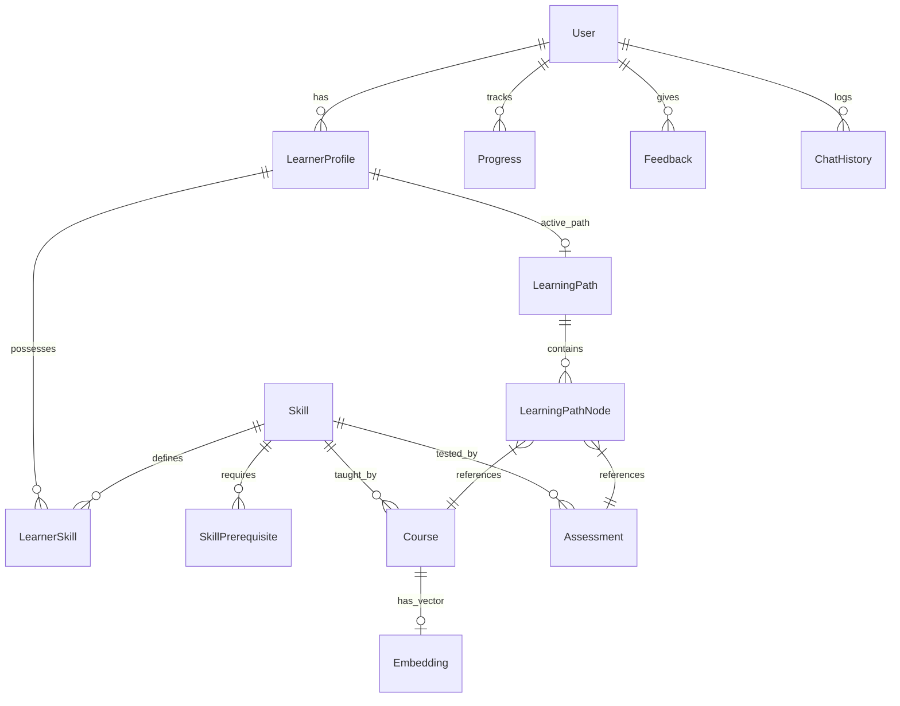

# Database Design

## 1. Entity Relationship Diagram



## 2. Table Schemas

### `users`
- `id` (UUID, PK)
- `name` (String)
- `email` (String, Unique)
- `password_hash` (String, nullable — null for Google OAuth users)
- `google_id` (String, Unique, nullable — populated on Google OAuth login)
- `avatar_url` (String, nullable)
- `created_at` (Timestamp)

### `learner_profiles`
- `id` (UUID, PK)
- `user_id` (UUID, FK → users.id)
- `goal` (String) — e.g. "Backend Developer"
- `experience_level` (Enum: BEGINNER, INTERMEDIATE, ADVANCED)
- `study_hours_per_week` (Int) — e.g. 10
- `timeline_months` (Int) — e.g. 6
- `created_at` (Timestamp)
- `updated_at` (Timestamp)

### `skills`
- `id` (UUID, PK)
- `name` (String, Unique)
- `description` (Text)
- `domain` (String)

### `skill_prerequisites`
- `skill_id` (UUID, FK)
- `prerequisite_skill_id` (UUID, FK)
- `importance` (Float)

### `learner_skills`
- `profile_id` (UUID, FK)
- `skill_id` (UUID, FK)
- `proficiency_level` (Float, 0.0 to 1.0)

### `courses` (Learning Resources)
- `id` (UUID, PK)
- `title` (String)
- `description` (Text)
- `url` (String)
- `difficulty` (String)
- `estimated_hours` (Int)
- `embedding` (Vector, pgvector type)

### `learning_paths`
- `id` (UUID, PK)
- `profile_id` (UUID, FK)
- `status` (String)

### `learning_path_nodes`
- `id` (UUID, PK)
- `path_id` (UUID, FK)
- `resource_id` (UUID, nullable, FK to courses/projects/assessments)
- `resource_type` (Enum: COURSE, PROJECT, ASSESSMENT)
- `milestone` (String)
- `status` (Enum: PENDING, IN_PROGRESS, COMPLETED, SKIPPED)
- `order_index` (Int)

## 3. pgvector Usage

The `courses` table (and potentially `skills` and `projects`) will contain an `embedding` column of type `vector(1536)` (assuming OpenAI `text-embedding-ada-002` or similar dimensionality).

To perform semantic similarity search during recommendation:
```sql
SELECT id, title, description, embedding <=> '[0.1, 0.2, ...]' AS distance
FROM courses
ORDER BY distance
LIMIT 10;
```
*(An HNSW index should be created on the `embedding` column for performance if the dataset grows large).*

---

## 4. Additional Tables

### `progress`
Tracks per-skill completion percentage for a user. Updated whenever a learning path node is marked complete or an assessment is graded.

- `id` (UUID, PK)
- `user_id` (UUID, FK → users.id)
- `skill_name` (String) — denormalized skill label for fast reads
- `skill_id` (UUID, FK → skills.id, nullable)
- `completion_percentage` (Float, 0.0 to 100.0)
- `last_updated` (Timestamp)

### `feedback`
Captures learner-submitted feedback after completing a node or milestone. Used by the AI mentor to recalibrate roadmap pacing.

- `id` (UUID, PK)
- `user_id` (UUID, FK → users.id)
- `node_id` (UUID, FK → learning_path_nodes.id, nullable)
- `feedback_text` (Text)
- `difficulty_level` (Enum: TOO_EASY, JUST_RIGHT, TOO_HARD)
- `created_at` (Timestamp)

### `chat_history`
Persists all AI tutor / mentor conversation turns for context injection on subsequent queries.

- `id` (UUID, PK)
- `user_id` (UUID, FK → users.id)
- `session_id` (UUID) — groups turns within one chat session
- `role` (Enum: USER, ASSISTANT)
- `message` (Text)
- `node_context_id` (UUID, nullable) — which roadmap node the user was on
- `timestamp` (Timestamp)

---

## 5. Seed Data Strategy
Initial development will require a robust set of seed data representing a specific domain (e.g., Data Science). A JSON seed file (`data/skills.json` and `data/courses.json`) will be loaded via a Python script (`python -m app.db.seed`) during database initialization to populate the foundational skill graph and course catalog.

---

## 6. Chat Message Persistence Model
Every chat turn (user and assistant) is stored in the `chat_history` table:

```
┌──────────────────────────────────────────────────────────────┐
│                       chat_history                           │
├──────────────┬───────────────┬────────────────────────────────┤
│ Column       │ Type          │ Description                    │
├──────────────┼───────────────┼────────────────────────────────┤
│ id           │ UUID (PK)     │ Unique message identifier      │
│ user_id      │ UUID (FK)     │ → users.id                     │
│ session_id   │ UUID          │ Groups messages in one session  │
│ role         │ Enum          │ USER | ASSISTANT | SYSTEM       │
│ message      │ Text          │ The message content             │
│ node_context │ UUID (nullable)│ Which roadmap node was active  │
│ timestamp    │ Timestamp(tz) │ When the message was created    │
└──────────────┴───────────────┴────────────────────────────────┘
```
